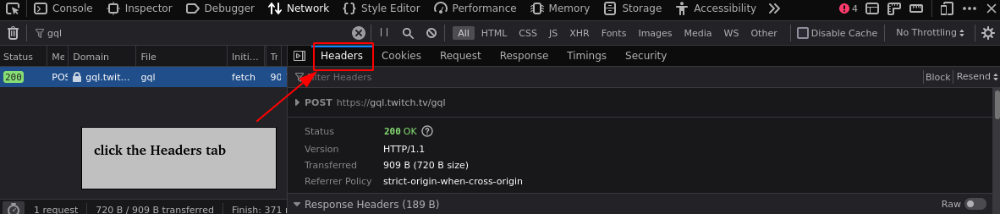

# twitch-emote-unlock

Tries to unlock the configured emotes in the configured channels
by using twitch's 'Choose an Emote to Unlock' and 
'Unlock a Random Sub Emote' functionality.

It may eat up your channel points :)

## Usage

1. Copy `config.example.toml` to `config.toml` and adjust as desired.
2. Install [python](https://www.python.org/downloads/)
3. Install [poetry](https://python-poetry.org/)
4. Run in a shell to install dependencies:
    ```
    poetry install
    ```
5. Run in a shell to launch the script:
    ```
    poetry run python run.py
    ```


**Alternatively you can use a pre built executable file:** 
1. Download a release archive from the releases [releases](https://github.com/Zutatensuppe/twitch-emote-unlock/releases/latest) page
2. Extract the archive and adjust the `config.toml` file as desired.
3. Launch the executable :)


### How to get the oauth_token required in the config.toml

1. In the browser login to twitch.tv with your account. Right click in 
    the browser and click 'Inspect'
    

2. Click the 'Network' tab
    

3. There should be a 'Filter' input box, type gql in there
    

4. Click one of the remaining rows, if there is no row, hit F5 once,
    and then click one of the rows
    

5. More details and tabs for the row will appear. Click the Headers tab.
    

6. Scroll down to find 'Authoriation: OAuth BLABLABLABLABLA' in the
    Request Headers section. 'BLABLABLABLABLA' is what you have to fill
    in here
    


### How to configure more channels

Add to the `config.toml` file blocks like these:

```toml
[[twitch_channels]]
name = "kitboga"
emotes = ["bogaShh", "bogaChamp"]
random_tries = 5
```
